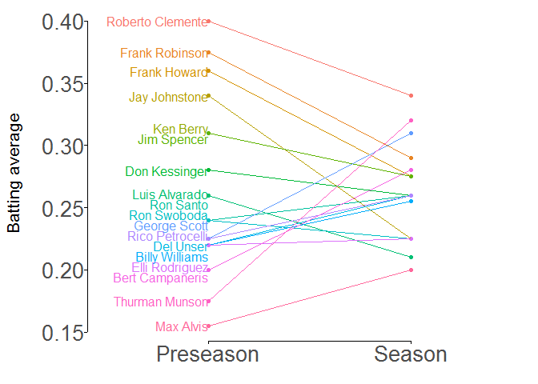

##loading packages 


```r
library(tidyverse);library(ggplot2);library(directlabels);library(lemon)
```

```
## -- Attaching packages ---------------------------------------------------------- tidyverse 1.2.1 --
```

```
## v ggplot2 3.1.1       v purrr   0.3.2  
## v tibble  2.1.1       v dplyr   0.8.0.1
## v tidyr   0.8.3       v stringr 1.4.0  
## v readr   1.3.1       v forcats 0.4.0
```

```
## -- Conflicts ------------------------------------------------------------- tidyverse_conflicts() --
## x dplyr::filter() masks stats::filter()
## x dplyr::lag()    masks stats::lag()
```

```
## 
## Attaching package: 'lemon'
```

```
## The following object is masked from 'package:purrr':
## 
##     %||%
```

##DATAFRAME

check these data


```r
names <- c("Roberto Clemente", "Frank Robinson", "Frank Howard", "Jay Johnstone", "Ken Berry", "Jim Spencer",
           "Don Kessinger", "Luis Alvarado", "Ron Santo", "Ron Swoboda", "Del Unser", "Billy Williams", "George Scott", "Rico Petrocelli", "Elli Rodriguez", "Bert Campaneris", "Thurman Munson", "Max Alvis")

preseason_hit <- c(0.400,0.375,0.360,0.340,0.310,0.310,0.280,0.260,0.240,0.240,0.220,0.220,0.225,0.225,0.220,0.200,0.175,0.155)

season_hit <- c(0.340,0.290,0.275,0.225,0.275,0.275,0.260,0.210,0.260,0.225,0.260,0.255,0.310,0.260,0.225,0.280,0.320,0.200)


baseball_league1 <- data.frame(Player = names, Preseason = preseason_hit, Season = season_hit)

baseball_league1
```

```
##              Player Preseason Season
## 1  Roberto Clemente     0.400  0.340
## 2    Frank Robinson     0.375  0.290
## 3      Frank Howard     0.360  0.275
## 4     Jay Johnstone     0.340  0.225
## 5         Ken Berry     0.310  0.275
## 6       Jim Spencer     0.310  0.275
## 7     Don Kessinger     0.280  0.260
## 8     Luis Alvarado     0.260  0.210
## 9         Ron Santo     0.240  0.260
## 10      Ron Swoboda     0.240  0.225
## 11        Del Unser     0.220  0.260
## 12   Billy Williams     0.220  0.255
## 13     George Scott     0.225  0.310
## 14  Rico Petrocelli     0.225  0.260
## 15   Elli Rodriguez     0.220  0.225
## 16  Bert Campaneris     0.200  0.280
## 17   Thurman Munson     0.175  0.320
## 18        Max Alvis     0.155  0.200
```

## Including Plots

Do you want a plot?

```
##  [1] "Bert Campaneris"  "Billy Williams"   "Del Unser"       
##  [4] "Don Kessinger"    "Elli Rodriguez"   "Frank Howard"    
##  [7] "Frank Robinson"   "George Scott"     "Jay Johnstone"   
## [10] "Jim Spencer"      "Ken Berry"        "Luis Alvarado"   
## [13] "Max Alvis"        "Rico Petrocelli"  "Roberto Clemente"
## [16] "Ron Santo"        "Ron Swoboda"      "Thurman Munson"
```

<!-- -->

Note that the `echo = FALSE` parameter was added to the code chunk to prevent printing of the R code that generated the plot.
